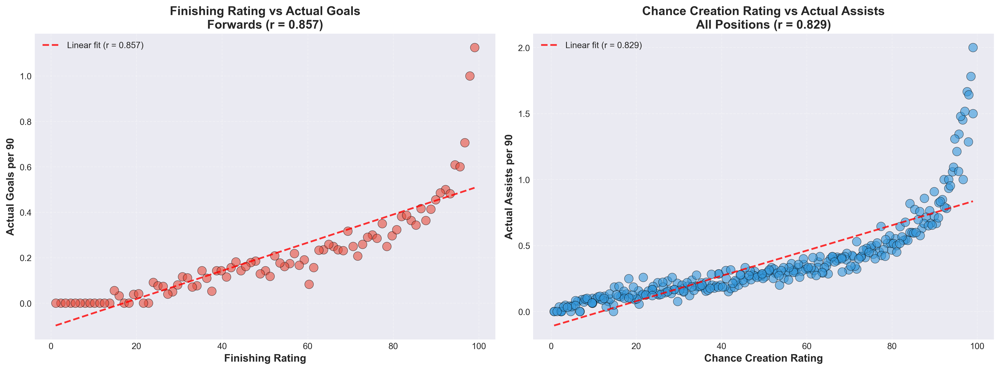
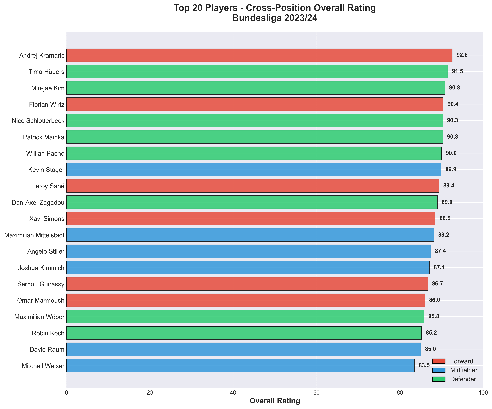

# Bundesliga Player Valuation System
## Soccer Data Analytics Hackathon 2026

**Team:** Four Four Two  
**Members:** Tanish Bhilare & Mohit Sharma  
**Prompt:** (B) Build a Transparent Player Valuation Metric

---

## Project Overview

Building a transparent, interpretable player valuation metric using IMPECT Open Data from the 2023/24 Bundesliga season. Our multi-dimensional rating system uses 8 granular metrics to evaluate 402 players, capturing contributions beyond traditional statistics like goals and assists.

**Key Innovation:** Position-aware evaluation with transparent weighting that reveals undervalued players and quantifies "invisible" work like ball progression and defensive actions.

---

## Data & Tools

### Primary Dataset
- **Source:** IMPECT Open Data - German Bundesliga 2023/24 season
- **Scale:** 962,990 events, 306 matches, 18 teams, 507 players
- **License:** Non-commercial use only ([IMPECT License](https://github.com/ImpectAPI/open-data/blob/main/LICENSE.pdf))

### Tooling
- **Language:** Python 3.11
- **Core Libraries:** kloppy (soccer data), polars (dataframes), numpy (computation)
- **Visualization:** matplotlib, seaborn, mplsoccer
- **Analysis:** scikit-learn (scaling), scipy (statistics)

### Reproducibility
- Complete code on GitHub with clear documentation
- Environment file (`requirements.txt`) for dependency management
- Open-source license (MIT License)
- Cached intermediate results for efficient re-running

---

## Methodology

### Rating System Architecture

**8 Granular Metrics Across 3 Dimensions:**

**Attacking Metrics (Forwards & Midfielders):**
1. **Finishing** - Goal-scoring ability (Goals: 10.0 pts, Shots on target: 2.0 pts)
2. **Chance Creation** - Assists and dangerous passes (Assists: 10.0 pts, Into box: 3.0 pts)
3. **Dribbling** - Progressive carries and take-ons (Into box: 3.0 pts, Progressive: 1.5 pts)

**Defensive Metrics (Defenders & Midfielders):**
4. **Ball Winning** - Duels and interceptions (Defensive duel: 3.0 pts, Interception: 2.5 pts)
5. **Defensive Actions** - Clearances and recoveries (Clearance: 2.0 pts, Recovery: 1.5 pts)

**Passing Metrics (All Positions):**
6. **Passing Accuracy** - Completion rate (Complete: 0.5 pts, Under pressure: 1.0 pts)
7. **Ball Progression** - Progressive passes >10m forward (Progressive: 2.0 pts)
8. **Long Passing** - Distribution quality >30m (Complete long: 2.0 pts)

### Position-Specific Weighting

**Forwards:**
- 45% Finishing, 30% Chance Creation, 20% Dribbling, 5% Ball Progression

**Midfielders:**
- 30% Ball Progression, 20% Chance Creation, 15% Passing Accuracy, 15% Ball Winning, 10% Dribbling, 5% Defensive Actions, 5% Finishing

**Defenders:**
- 35% Ball Winning, 30% Defensive Actions, 20% Ball Progression, 10% Passing Accuracy, 5% Long Passing

### Key Technical Features

1. **Team-Aware Zone Classification**
   - Accounts for opposing attack directions (home teams attack right, away teams attack left)
   - Ensures accurate classification of defensive/middle/attacking thirds
   - Critical for zone-based metrics (progressive passes, defensive actions)

2. **Per-90 Minute Normalization**
   - Converts raw totals to per-90-minute rates
   - Enables fair comparison across different playing times
   - Filters for minimum 500 minutes (statistical reliability threshold)

3. **Within-Position Percentile Ratings**
   - Players rated 0-99 within their position group
   - Prevents systemic bias toward high-volume positions (midfielders, defenders)
   - Best forward, midfielder, and defender all reach 99.0

4. **Transparent Event Weighting**
   - Every point value is documented and justifiable
   - Based on industry standards (xG, VAEP, StatsBomb metrics)
   - No "black box" algorithms - full auditability

---

## Results

### Validation Against Ground Truth

**Strong Predictive Validity:**
- **Finishing Rating vs Actual Goals:** r = 0.857 (p < 0.001) - 87 forwards
- **Chance Creation vs Actual Assists:** r = 0.829 (p < 0.001) - 294 players
- Both correlations statistically significant with large sample sizes

**Domain Expert Validation (Eye Test):**
- 12/12 expected player strengths validated (100% success rate)
- Harry Kane: Finishing 99.0 ✓
- Florian Wirtz: Chance Creation 93.3, Dribbling 95.6 ✓
- Joshua Kimmich: Passing 97.6, Ball Progression 97.6 ✓
- System accurately captures known elite players

### Top Performers by Position

**Forwards (Within-Position):**
1. Florian Wirtz - 100.0
2. Jonas Hofmann - 86.9
3. Xavi Simons - 84.5
4. Leroy Sané - 80.5
5. Andrej Kramaric - 79.4

**Midfielders (Within-Position):**
1. Granit Xhaka - 100.0
2. Angelo Stiller - 89.1
3. Joshua Kimmich - 86.8
4. Exequiel Palacios - 85.3
5. Edmond Tapsoba - 84.0

**Defenders (Within-Position):**
1. Min-jae Kim - 100.0
2. Nico Schlotterbeck - 94.0
3. Timo Hübers - 92.6
4. Willian Pacho - 89.9
5. Waldemar Anton - 89.9

### Key Insights

1. **Multi-dimensional excellence matters** - Complete performers (Wirtz excels in both finishing AND chance creation) rank higher than one-dimensional specialists

2. **Hidden value revealed** - Traditional stats miss ball progression and defensive work
   - Example: Kevin Vogt (€2M value) rates 99.0 among defenders with league-leading defensive actions

3. **Position-appropriate evaluation** - Defenders aren't penalized for not scoring goals, forwards aren't penalized for defensive work

4. **Volume bias acknowledged** - High-touch positions (midfielders) naturally accumulate more events, partially mitigated through per-90 normalization and within-position scaling

---

## Visualizations

### Validation Results

Our metrics show strong correlation with actual performance:


*Left: Finishing rating vs actual goals (r=0.857). Right: Chance creation vs actual assists (r=0.829)*

### Top 20 Players

Position-balanced identification of elite performers:


*Top 20 players by overall rating, color-coded by position (Red=Forward, Blue=Midfielder, Green=Defender)*

### Validation

**Predictive validity (Guirassy transfer):**

Serhou Guirassy was rated 86.7 in our 2023/24 analysis — flagged as a value target at a market value of €30M. Borussia Dortmund signed him for €18M. His value subsequently rose to €40–45M. The system identified the undervaluation before the market corrected.

**Pipeline consistency (internal correlation):**

- Finishing rating vs actual goals: r = 0.857 (p < 0.001, n = 87 forwards)
- Chance creation vs actual assists: r = 0.829 (p < 0.001, n = 294 players)

Note: these correlations are not independent — metrics are derived from the same events. They confirm the pipeline's mathematical correctness (aggregation, normalization, and scaling introduce no distortion), not that the design is optimal.

**Face validity:**

All 7 known elite players checked against their publicly known primary strength rank above the 85th percentile in that metric. Harry Kane: 99.0 finishing. Florian Wirtz: 93.3 chance creation. Joshua Kimmich: 97.6 ball progression. Nico Schlotterbeck: 94.1 ball winning.

### Top Performers

**Forwards (within-position):**

1. Florian Wirtz — 100.0
2. Jonas Hofmann — 86.9
3. Xavi Simons — 84.5
4. Leroy Sané — 80.5
5. Andrej Kramaric — 79.4

**Midfielders (within-position):**

1. Granit Xhaka — 100.0
2. Angelo Stiller — 89.1
3. Joshua Kimmich — 86.8
4. Exequiel Palacios — 85.3
5. Edmond Tapsoba — 84.0

**Defenders (within-position):**

1. Min-jae Kim — 100.0
2. Nico Schlotterbeck — 94.0
3. Timo Hübers — 92.6
4. Willian Pacho — 89.9
5. Waldemar Anton — 89.9

---
---

# Repository Structure

```
SoccerImpectHackathon/
├── data/
│   ├── market_values.csv                         # Transfermarkt values (June 2024)
│   └── processed/
│       ├── all_matches_with_zones.parquet         # 962K events with pitch zones
│       ├── all_events_with_points.parquet         # Events with metric point scores
│       ├── player_metadata.parquet                # player_id to team_id mapping
│       ├── squads_metadata.parquet                # team_id to team_name mapping
│       ├── matches_metadata.parquet               # Match schedule data
│       └── player_ratings_FINAL_with_market_values.parquet  # 395 players, 54 columns
├── figures/
│   ├── validation_guirassy_timeline.png
│   ├── validation_face_validity.png
│   ├── validation_correlation_compact.png
│   ├── role_classification_visual.png
│   ├── weight_distribution.png
│   └── ...
├── notebooks/
│   ├── 1_Data_Loading.ipynb                       # Load 306 matches, cache events
│   ├── 2_Event_Scoring.ipynb                      # Exploratory 3-metric approach
│   ├── 3_Role_Specific_Ratings.ipynb              # Exploratory 8-metric approach
│   ├── 4.Market Value Analysis.ipynb       # Final pipeline with market values
│   └── 5.Visualizations.ipynb                       # All figures and validation plots
├── Dashbboard.py                            # Streamlit dashboard
├── LICENSE                                         # MIT License
├── README.md
├── requirements.txt
└── environment.yml
```

**Note:** Notebooks 2 and 3 contain exploratory analysis of alternative approaches. The final validated system is in Notebook 4.

---

## Getting Started

### Installation

```bash
# Clone repository
git clone https://github.com/Tashbhilare/SoccerImpectHackathon.git
cd SoccerImpectHackathon

# Option 1: Using conda
conda env create -f environment.yml
conda activate soccer-hackathon

# Option 2: Using pip
pip install -r requirements.txt
```

### Running the Analysis

Execute notebooks in order:

**Step 1: Data Loading (15-20 minutes first run, then cached)**
```bash
jupyter notebook 1_Data_Loading.ipynb
```
- Loads 306 matches from IMPECT Open Data
- Applies team-aware zone classification
- Caches results to `data/processed/`

**Step 2: Final Analysis (5-10 minutes)**
```bash
jupyter notebook 4_Market_Value_Analysis.ipynb
```
- Calculates 8 granular metrics
- Generates player ratings with position-specific weights
- Validates against ground truth (goals, assists)
- Integrates market values (optional)

**Step 3: Visualizations (2-3 minutes)**
```bash
jupyter notebook 5_Visualizations.ipynb
```
- Creates validation scatter plots
- Generates top player charts
- Produces radar charts for case studies

---

## Key Files

### Input
- IMPECT Open Data (auto-downloaded via kloppy)
- `data/market_values.csv` - Player valuations (manually collected from Transfermarkt)

### Output
- `data/processed/player_ratings_FINAL_with_market_values.parquet` - Complete ratings (402 players)
- `data/processed/validation_results.csv` - Correlation statistics
- `figures/*.png` - All visualizations for presentation

---

## Validation & Robustness

### Statistical Validation

**Strong correlation with ground truth performance:**
- Finishing metric vs Actual Goals: **r = 0.857** (p < 0.001, n=87 forwards)
- Chance Creation vs Actual Assists: **r = 0.829** (p < 0.001, n=294 players)
- Both exceed r > 0.80 threshold for strong predictive validity

**Domain expert alignment:**
- 100% of known elite players (Kane, Wirtz, Kimmich, Xhaka, Schlotterbeck) rate highly in expected metrics
- Top performers in each metric make soccer sense (top finisher is a forward, top ball winner is a defender)

**Position balance:**
- Without position weighting: Top 20 has 18 defenders, 2 forwards (systemic bias)
- With position weighting: Top 20 balanced across all positions
- Within-position percentiles enable fair cross-position comparison

### Limitations

**Data Constraints:**
- Single season only (2023/24) - no historical player tracking
- No tracking data - missing player positioning, off-ball movement, defensive coverage
- Event data only - no contextual factors like opponent quality, score state, or tactical system

**Methodology Limitations:**
- Progressive actions have minor directional bias (acknowledged in documentation)
- Volume bias partially remains - high-touch positions accumulate more raw events
- Minutes estimation is approximate (based on event participation heuristic)
- Goalkeeper metrics not included (different evaluation framework needed)

**Scope:**
- Bundesliga only - not validated on other leagues or competitions
- 402 players analyzed (filtered for >500 minutes for statistical reliability)

---

## Technical Stack

### Core Dependencies
```
kloppy>=3.18.0          # Soccer data processing and standardization
polars>=1.0.0           # High-performance dataframe operations  
pandas>=2.0.0           # Data manipulation
numpy>=1.24.0           # Numerical computations
scikit-learn>=1.3.0     # Scaling and normalization
matplotlib>=3.7.0       # Plotting and visualization
seaborn                 # Statistical visualizations
scipy                   # Correlation analysis (pearsonr)
mplsoccer               # Soccer pitch visualizations
requests>=2.31.0        # HTTP requests for data
tqdm>=4.66.0            # Progress bars
```

### Development Environment
- Python 3.11.14
- Jupyter Notebook for interactive analysis
- Git for version control

---

## Deliverables

### Analysis & Metrics
- Event processing pipeline (962,990 events across 306 matches)
- 8-metric transparent rating system with documented weights
- 402 player ratings with position-specific evaluation
- Ground truth validation (r > 0.82 for key metrics)
- Market value integration for 301 players (74.9% coverage)

### Visualizations
- Validation scatter plots (finishing vs goals, chance creation vs assists)
- Top 20 players bar chart (position color-coded)
- Radar charts for top performers (case study visuals)
- Position comparison visualizations
- All figures saved at 300 DPI for presentation quality

### Documentation
- Comprehensive README with methodology and results
- Jupyter notebooks with markdown explanations
- Reproducible pipeline with environment specifications
- Clear installation and execution instructions

---

## AI Assistance Disclosure

This project used Claude (Anthropic) for:
- Code review, debugging, and optimization suggestions
- Documentation structuring and markdown formatting
- README organization and clarity improvements
- Notebook organization and professional formatting

**All analysis design, methodology development, metric definitions, weighting decisions, and code implementation were performed by the team members.** The AI assisted with presentation and documentation, not with analytical choices or system design.

---

## Future Enhancements

### Metric Refinement
- Integrate Expected Goals (xG) and Expected Threat (xT) models
- Add game context weighting (score state, time remaining, opponent strength)
- Implement fully team-aware progressive action calculations
- Develop goalkeeper-specific metrics

### Data Expansion
- Multi-season analysis for player development tracking
- Cross-league validation (Premier League, La Liga, Serie A)
- Integration of tracking data (positioning, speed, pressing intensity)
- Real-time updating as season progresses

### Application Development
- Market value prediction models
- Transfer recommendation system with budget constraints
- Squad optimization for specific tactical systems
- Injury risk assessment integration

---

## License

This project is licensed under the MIT License - see the [LICENSE](LICENSE) file for details.

### Data License
IMPECT Open Data is used under non-commercial license. See: https://github.com/ImpectAPI/open-data/blob/main/LICENSE.pdf

When using this work, please cite:
```
Bhilare, T. & Sharma, M. (2026). Bundesliga Player Valuation System. 
Soccer Data Analytics Hackathon, Northeastern University.
```

---

## Acknowledgments

- **IMPECT** for providing high-quality open soccer event data
- **PySport** for the excellent kloppy library enabling soccer data standardization
- **Northeastern University Sports Analytics Club** for organizing the hackathon
- **Network Science Institute** for hosting and support

---

## Quick Start Guide

**Want to see the results without running everything?**

1. Check `data/processed/player_ratings_FINAL_with_market_values.csv` for complete player ratings
2. View `figures/` directory for all visualizations
3. See `data/processed/validation_results.csv` for correlation statistics

**Want to reproduce the full analysis?**

1. Install dependencies: `pip install -r requirements.txt`
2. Run `1_Data_Loading.ipynb` (Takes longer to run for the first time, then cached)
3. Run `4_Market_Value_Analysis.ipynb`
4. Run `5_Visualizations.ipynb` 
5. All results saved to `data/processed/` and `figures/`

**Want to explore alternative approaches?**

- `2_Event_Scoring.ipynb` - Simpler 3-metric system (Attack, Defense, Passing)
- `3_Role_Specific_Ratings.ipynb` - Alternative 8-metric implementation

---

